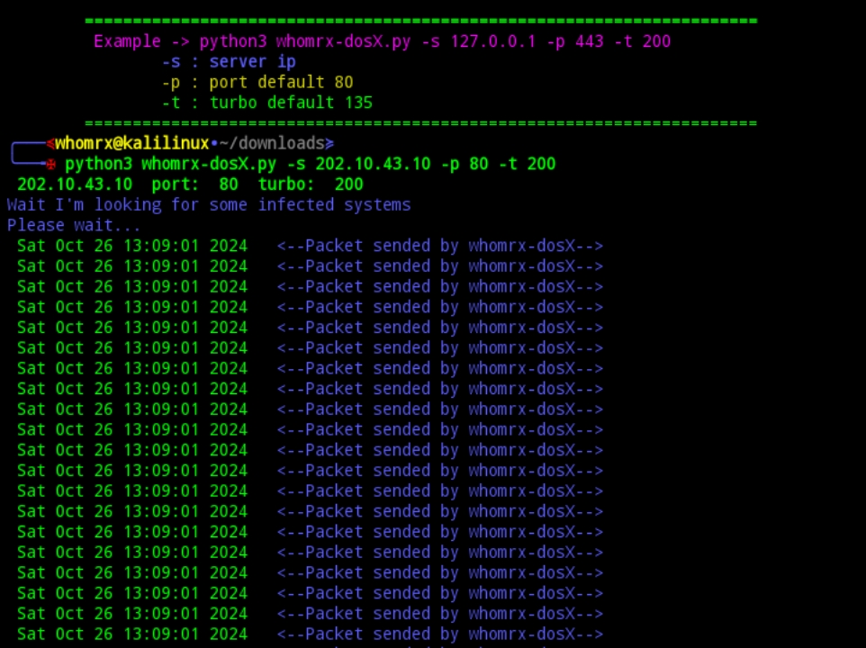

# whomrx-dosX


## introduction
whomrx-dosX is a ddos tool that sends a number of packets to the target server until it goes down.

## Instalations
```
$ pkg update -y && pkg upgrade -y
$ apt update -y && apt upgrade -y
$ pkg install git
$ pkg install python -y
$ git clone https://github.com/Whomrx666/whomrx-dosX
$ cd whomrx-dosX
$ python3 whomrx-dosX.py
```
## Example for use
```
$ python3 whomrx-dosX.py -s <ip target> -p 80 -t 200
```

## Instructions
- **first**: Install tools according to the instructions above
- **second**: Enter the command and target IP according to the example above
- **third**: The tool will start sending packets to the target server
- **last**: Wait for the time out message to appear, it is certain that the website is down

## Observation
This is a tool for education only, I am not responsible for any misuse
### Original Author
<a href="https://github.com/Whomrx666"></a>

### <<< If you copy , Then Give me The Credits >>>

## CONNECT WITH ME :

[](https://whomrxhackers.blogspot.com/)
[](https://twitter.com/whomrx666)
[](https://youtube.com/@whomrxhackers)
[](https://facebook.com/https://www.facebook.com/whomrx.666)
[](https://t.me/@Whomr_X)
[](mailto:whomrx666@gmail.com)
[](https://www.tiktok.com/@whomr.x)

**If you want to donate, click on the button**
<a href="https://saweria.co/whomrx"></a>

### Visitors :
